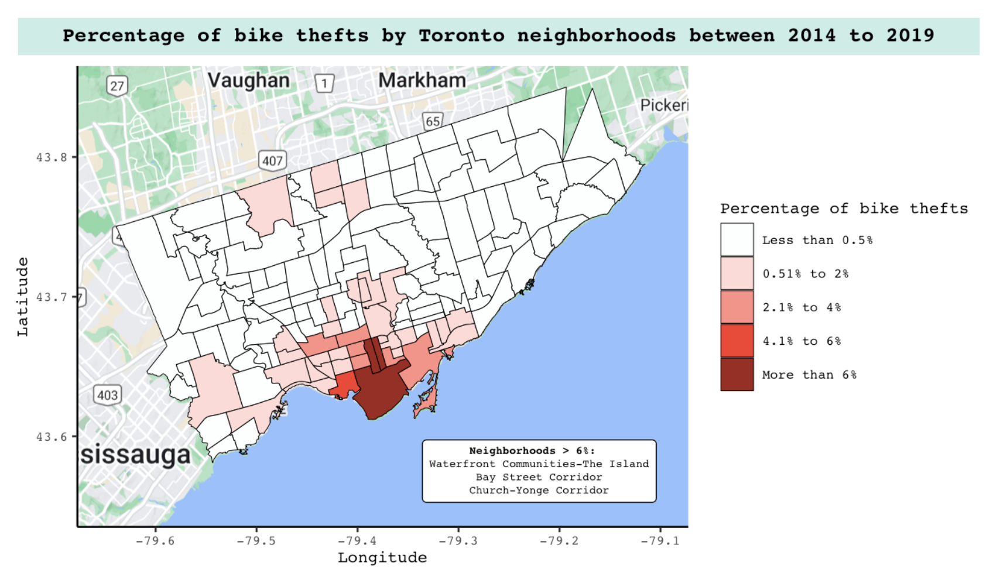
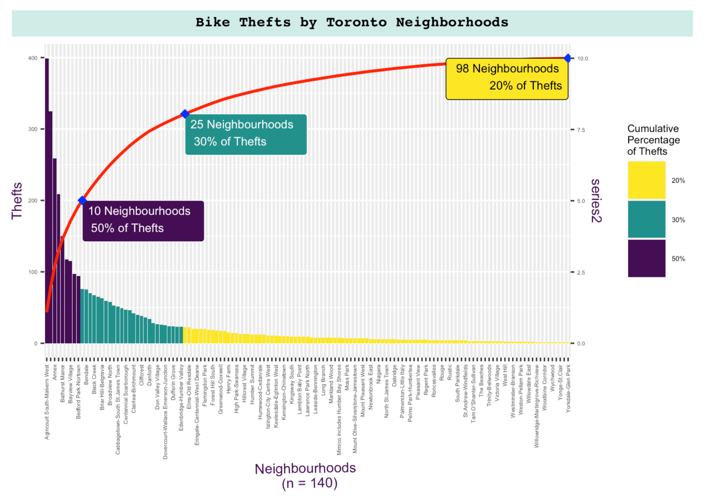
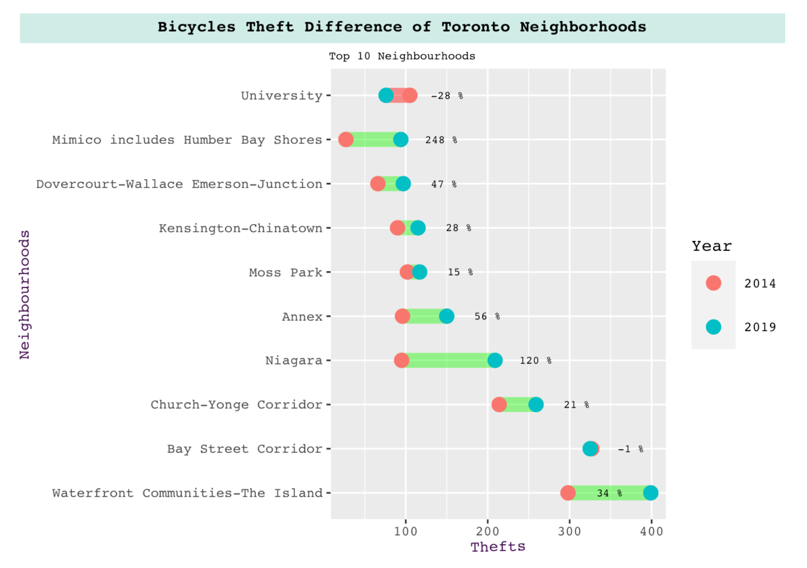
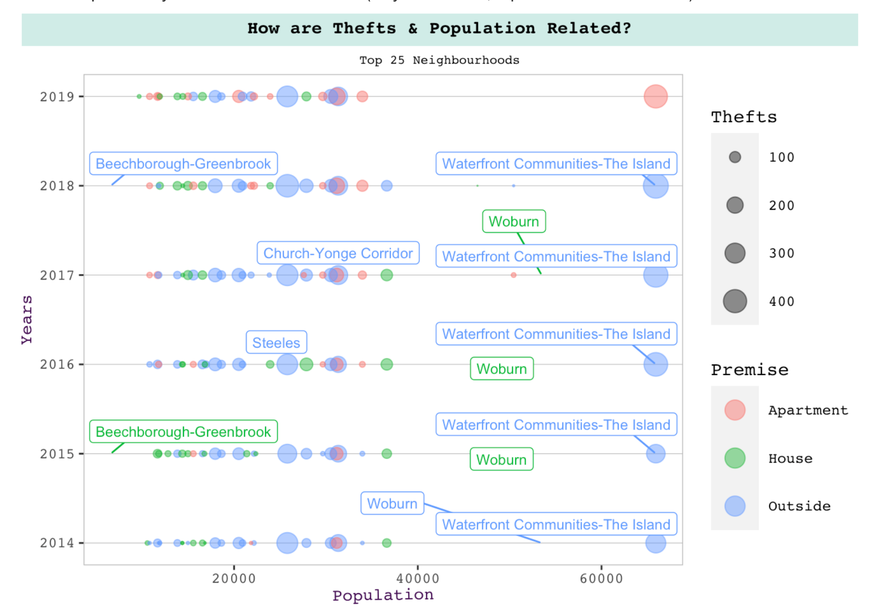
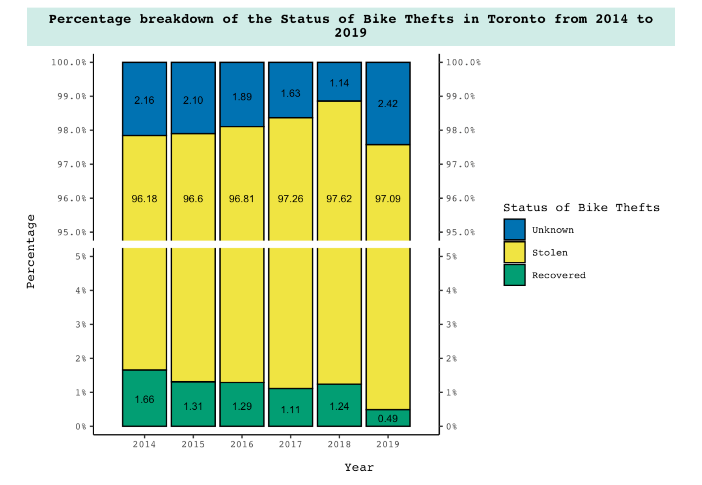
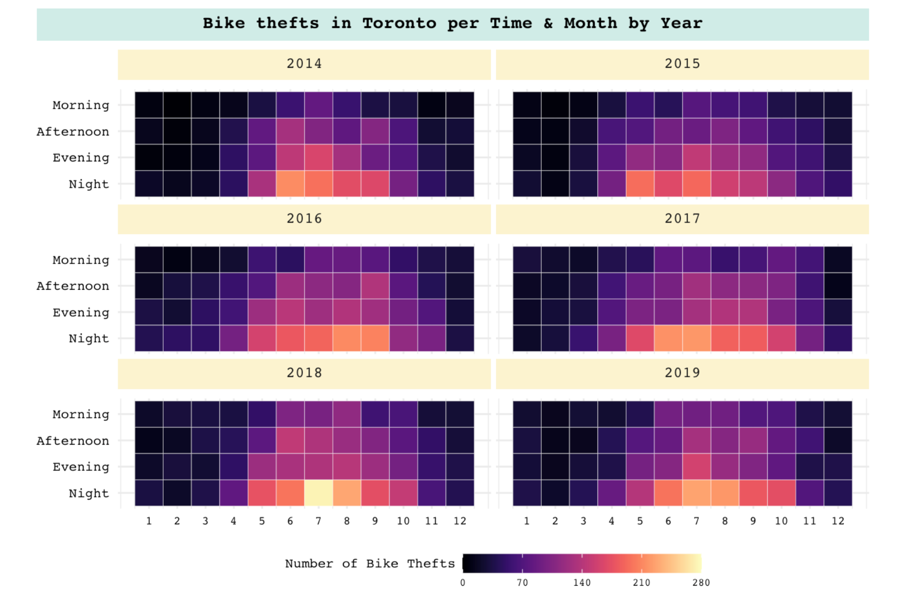

# Breaking into Bicycle Thefts - Insights from Toronto, Ontario

Did you know Toronto is one of the safest cities across the globe? The Safe Cities Index published by The Economist ranks Toronto as the second safest urban city in 2021! (The Economist, Safe cities index 2019) With that being said, Toronto does experience different levels of crime: even bicycle theft. Cycling is a rapidly growing transportation mode in the city, promoting physical activity, cleaner environments and eased vehicle congestion. However, the appeal is ruined if you worry about your bike getting stolen. For the cyclist community, we want to inform them of how safe the city is when it comes to their bikes.

From our study, the City of Toronto and their police divisions stand to learn where their attention should be focused to improve bicycle safety in its 140 neighbourhoods.

Our article aims to explore bicycle thefts in depth, making it relevant to the audiences of the public and government. And it is all centered around the data of over 21,000 bicycle thefts provided by the City of Toronto within the span of 2014 to 2019. (Toronto Police Service, Bicycle thefts 2022) (City of Toronto, Open data dataset 2017)

At the end of this article you should be able to answer these two questions.
1. Where should you be parking their bike? How cautious should you be?
2. Where is bike theft really happening? Where should we enforce more safety measures?

## Examining the bicycle theft by neighborhoods

For anyone that owns a bicycle in Toronto, we have all had the thought, “Will my bicycle be there when I come back?” in our heads at some point. And of course, when we decide to park our bicycle, we try to park it in a location that feels secure. To gain a beter understanding of the locational differences in the number of bicycle thefts in Toronto, the visualization below shows the neighborhoods with the highest percentage of bicycle thefts in Toronto from 2014 to 2019.

With this visualization let us answer the following two questions.
1. Is bicycle theft occurring evenly in all neighborhoods in Toronto?
2. Which cluster of neighborhoods seem to have the most bicycle theft?

The map above shows that bicycle theft in Toronto is concentrated in a number of neighborhoods. We also see that three neighborhoods; Waterfront Communities, Bay Street Corridor & Church-Yonge Corridor are the only neighborhoods that account for more than 6% of the bicycle thefts. The city of Toronto has its downtown closest to these three neighborhoods, so it is unsurprising that there are the most bicycle thefts concentrated in these areas. 

We can also draw insights from this visualization to answer our second question. The map shows that the number of bicycle thefts by neighborhood have a location based pattern. We see that the neighborhoods that are closest to the Toronto downtown area have the most bicycle thefts. We also see that bicycle theft decreases gradually as neighborhoods get further away from the downtown area. Hence, we can observe that bicycle thefts are clustered near the downtown neighborhoods and gradually decrease in frequency as we move out. 

With any visualization we should also note its shortcomings. Note that the map only captures cases that were correctly registered by the Toronto Police. Hence, due to inaccurate data collection and reporting, not all bicycle theft crimes have been included in this map and may underrepresent the magnitude of bicycle thefts. The map visualization’s main goal is to highlight which neighborhoods suffer from bicycle theft the most, and therefore the map does not take into account the population of each neighborhood. This limitation with population is addressed in the fourth visualization below. 

## Examining the most relevant neighborhoods

From examining the map, we can visually observe that most parts of Toronto do not have a major percentage of bike thefts. However, we do see a concentration near the most southern ends of Toronto. Let’s compare the 140 neighbourhoods in the most recent year 2019 on a large scale to see how it is distributed individually. 

By interpreting the Pareto chart above, we see the frequency of thefts is high in only some select neighborhoods. The line, defined for the accumulation of thefts, shows its largest leap from zero is only in the beginning, and then it tapers off for the majority. 

Based on this visualization, half of all bike thefts only occur in 10 neighborhoods of Toronto, out of the 140 that exist. In contrast, almost 96 neighbourhoods only contain 20% of all bicycle thefts. It seems evident that the reputation of just ten neighbourhoods outweighs most in Toronto. Have these communities always been infamous for bicycle theft? 

Our main takeaway? More than half of bike thefts occur in 6% of Toronto. 

## Examining the yearly changes in bicycle thefts

To determine any changes in the number of thefts between the two years 2014 and 2019, we have created a dumbbell plot. We aim to highlight how top 10 neighbourhoods have changed within the span of six years. 

Evidently, most of our top 10 neighborhoods have experienced an increase in the number of thefts. Some neighborhoods had over a 100% change in bike thefts, while others were less drastic. In general, it seems these neighborhoods have always had high theft rates for bicycles. Our highest neighborhood for bike theft in 2019, Waterfront, was not always the highest, seemingly having captured this position from Bay Street Corridor. 

Based on what we see, bike thefts have steadily increased from 2014, only to decrease very slightly in 2019. However, why do some neighborhoods have high bike theft rates in Toronto? What factors can we attribute this amount to? 

## Examining population and bicycle thefts

With Toronto being one of the most populous cities in North America, it makes us wonder: Does population within Toronto Neighbourhoods affect bike theft rates? This question resulted in us creating a visualization where we compare bike thefts to the population size of each neighbourhood, over the span of 6 years from 2014 to 2019. (City of Toronto, Open data dataset 2017) 

To create a comprehensible visualization, we’re examining the top 25 neighborhoods for bike theft each year. This includes the top 10 that we have been keen on analyzing. While the horizontal axis represents the population size, the size of each bubble plotted shows how many bike thefts occurred. We’ve highlighted some particular communities in the chart, and it’s becoming evident that population size is not necessarily a factor for bike theft occurrence. 

One could naturally assume: larger community, more bike thefts. We are trying to dismantle this notion with this chart. One of our number one neighborhoods for bike theft, Waterfront, is fairly the largest population and its size shows us there are many bike thefts. However, take a look at communities like Woburn. A greater size in population, but the bike thefts are incredibly minimal, the plotted point is barely visible! This also applies when looking at some smaller size communities: neighborhoods like Steeles are lower in population yet a visible enough point when it comes to the number of thefts. 

Overall, the population can’t be solely reasoned as to why bike thefts happen. Although we weren’t able to look at each neighborhood in close with this graph, we did see that bike thefts go beyond other factors that cannot be simply explained. For example, Waterfront is a downtown area and although it is large in population, there are also more crowds there, it is more a bustling community, which may have a greater size of cyclists. 

One more interesting insight from this chart is how majority of thefts, the premises are mainly outside. The blue points are evidently the larger ones compared to the other premises. This would agree with what we would naturally assuming: your bike is less protected when not at home. 

## Examining the aftermath of bicycle thefts

So far in our visualizations, we have been able to examine how incredibly common bicycle thefts are in certain neighborhoods in Toronto. However, when one’s bicycle is stolen, the story rarely ends there. Even after the thefts, we would all want our stolen bicycles to be recovered and returned to our possession. Let us now examine bicycle thefts and their status after the crime has been committed.

With this visualization, we aim to answer the following questions.
1. Can I count on my bicycle to be recovered after theft in Toronto?
2. Has recovery rate of bicycle thefts improves over the years?

The visualization above shows the percentage breakdown of the status os bicycle thefts in Toronto from 2014 to 2019. Taking the most recent year of 2019, we can see that only 0.49% of bicycles were recovered after theft, in comparison to the 97.09% of bicycles that remain stolen. The visualization shows that this pattern in a recovery and stolen rates remains relatively unchanged over the years. And we also see that ever so slightly that recovery rates have been decreasing when comparing across years of 2014 to 2019. Unfortunately, this visualization shows the grim reality of recovery after bicycle theft. We can observe that in Toronto, after your bicycle has been stolen we should not count for it to be recovered after.

The reader should keep in mind that this visualization has some visual shortcomings. From a first glance at this visualization, one can misinterpret the proportions of the categories as one may miss the truncated percentage axis, cutting off the graph at 5% and resuming at 95%. One should be able to get an idea of the reality of the proportions by examining the percentages on the bar charts.

## Examining seasonality and time of bicycle thefts

Our results currently are very grim, and as a bicycle owner or cyclist you may feel as if there is little you can do to keep your bicycle safe. Let’s use data to try to find some suggestions on how we can keep our bicycles safe and in our own hands.

With this visualization, let us try to answer the following questions.
1. Which seasons are the most dangerous seaons for bicycle theft in Toronto?
2. What time is the most dangerous/safest time to park your bicycle in Toronto?

The visualization above shows a heat map of the bicycle thefts in Toronto per time and month for the years between 2014 to 2019. Firstly, from the visualization we can see that the patterns involving time and month are very consistent across the years of 2014 and 2019. This indicates to us that the most dangerous times and months for bicycle theft has remained the same across these 5 years.

We can see from the heat map that bicycle thefts exhibit a seasonal pattern. We can see that the summer months from June to August have the highest number of bicycle theft cases. This makes intuitive sense as Toronto experiences very cold and icy winters, making it impossible to bike around in the city during the colder months. In term of the time of day, we can observe that bicycle thefts are highest at night, and decrease in following order; evening, afternoon, and the least in the morning. Hence, to our fellow bicycle owners, from this visualization we can interpret that the safetest time to park your bicycle in Toronto is during the morning and afternoon.

The reader should keep in mind that this visualization is prone to some subjectivity. In our visualization we have defined morning as between 5AM to noon, afternoon as between noon to 5PM, evenings as between 5Pm to 20PM and night as between 10PM to 5AM. Since there is no set consensus on when mornings or afternoons start, reader’s should be aware that these subjective ranges time used in the visualization.

## Conclusion

While we went through a lot of data and a lot of analysis, our main findings can be summarized in the six points below.

1. Most bicycle thefts in Toronto are happening in the neighborhoods near downtown Toronto, and bicycle theft numbers decrease as you move farther away from the downtown.
2. More than half of the bicycle thefts occur in the 10 neighbourhoods of Toronto out of 140.
3. The top 10 neighborhoods have experienced an increase in the number of bicycle thefts over the years 2014 to 2019.
4. Population size is not necessarily a factor for bicycle theft occurrence. A large population in a neighborhood does not mean higher bicycle thefts.
5. If your bicycle is ever stolen in Toronto, it is very unlikely for it to be recovered.
6. In Toronto, bicycle thefts are most frequent in the summer months at night time.

What can we do with these findings? And how can cyclist protect themselves from bicycle thieves after knowing our results? 
We would like to suggest some actionable insights from our data results. To combat the rising bicycle theft cases, the Toronto police should increase police funding and patrol in the summer nights for the top 10 bicycle theft prone neighbourhoods. 

For our fellow cyclists and bicycle owners, we suggest to be more careful of parking you bicycle when parking in one of the top 10 bicycle theft prone neighbourhoods. Possible steps cyclists can take is to get your bicycle registered, get more secure locks or add a GPS to your bicycle. We would also suggest avoiding leaving your bicycle parked outside overnight in the summer months as well. We hope these data visualizations and insights gave you a better idea of the bicycle theft reality in Toronto, and helped you keep your bicycle safer and in your hands.

## References

Open data dataset. City of Toronto Open Data Portal. (n.d.). Retrieved November 10, 2022, from [https://open.toronto.ca/dataset/wellbeing-toronto-demographics/](https://open.toronto.ca/dataset/wellbeing-toronto-demographics/)

The Economist Newspaper. (n.d.). Safe cities index 2019. The Economist. Retrieved November 10, 2022, from [https://safecities.economist.com/safe-cities-index-2019/](https://open.toronto.ca/dataset/wellbeing-toronto-demographics/)

Toronto Police Service. (n.d.). Bicycle thefts. Public Safety Data Portal. Retrieved November 10, 2022, from [https://data.torontopolice.on.ca/datasets/TorontoPS::bicycle-thefts/about](https://open.toronto.ca/dataset/wellbeing-toronto-demographics/)
